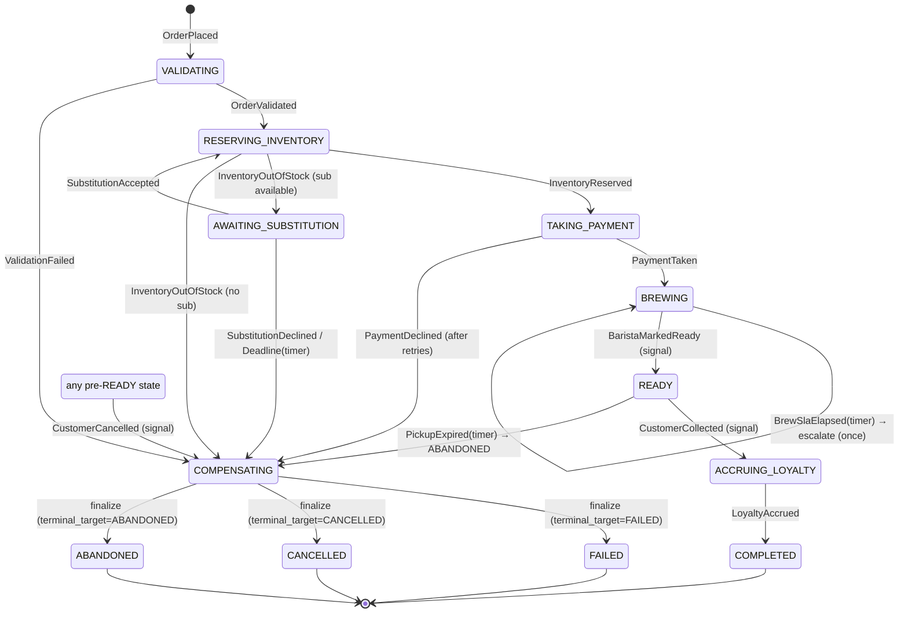
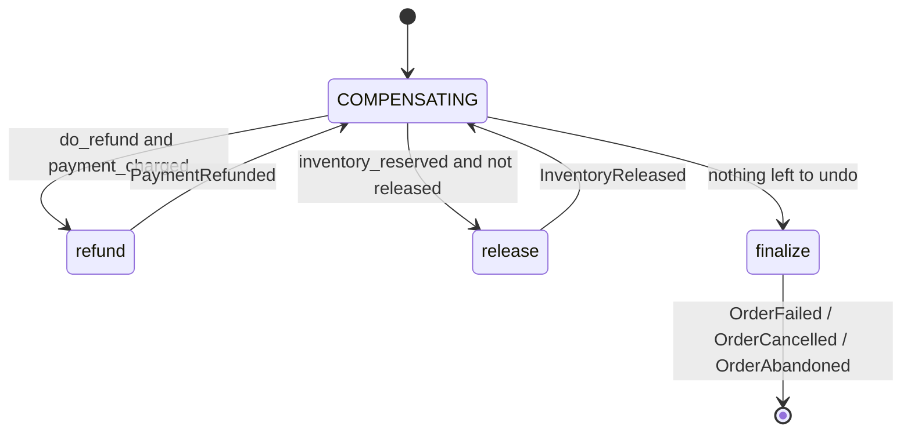

# StarHarbour Order Workflow — State Diagram

The order is a single long-running state machine. **Non-terminal statuses double
as the program counter**: the decider looks at the status to choose the next
activity. Transitions are driven by three kinds of inputs:

- **activity results** (validate, reserve, payment, loyalty …)
- **external signals** (barista ready, customer collected, cancel, substitution answer)
- **timers** (substitution deadline, brew SLA, pickup expiry)

## Lifecycle

## The compensation sub-machine

`COMPENSATING` is entered from many places; it runs the *pending* undo actions
in a fixed order, then finalizes to the chosen terminal status. Each step is a
durable event, so compensation itself is crash-safe and idempotent.

`do_refund` is decided at the moment we enter compensation:

| Trigger | terminal_target | do_refund | Why |
|---------|-----------------|-----------|-----|
| Validation failed | FAILED | no | nothing charged |
| Payment declined (F2) | FAILED | no | nothing charged; release inventory |
| Out of stock, no substitution / declined / timeout (F3) | CANCELLED | yes* | refund if anything was charged (nothing is, pre-payment) |
| Cancel **before** drinks made (F4) | CANCELLED | yes | money back, release inventory |
| Cancel **after** drinks made | ABANDONED | no | drinks wasted, charge stands |
| Pickup expired (F5) | ABANDONED | no | drinks made & paid → waste policy |

\* `do_refund=True` is harmless when there is no charge — the decider's
`needs_refund()` guard skips the refund step.

## Failure-scenario → path

| # | Path |
|---|------|
| **F1** | `TAKING_PAYMENT` retries `take_payment` w/ backoff (same Idempotency-Key) → `PaymentTaken` → `BREWING` |
| **F2** | `TAKING_PAYMENT` → `PaymentDeclined` → `COMPENSATING` → release → finalize → `FAILED` |
| **F3** | `RESERVING_INVENTORY` → `InventoryOutOfStock` → `AWAITING_SUBSTITUTION` → (accept→`RESERVING_INVENTORY`) or (decline/`SubstitutionDeadline`→`COMPENSATING`→`CANCELLED`) |
| **F4** | `…/BREWING` → `CustomerCancelled` → `COMPENSATING` → refund → release → `CANCELLED` |
| **F5** | `READY` → `PickupExpired` → `COMPENSATING` → release → `ABANDONED` |
| **F6** | crash at any point → reload event log → `apply`-fold to last state → continue; pending activities re-run idempotently |
